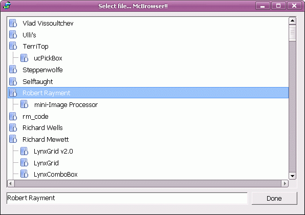



## McListBox Original by Jim Jose \(Small Addittion Update\)

### Description

PLEASE DON'T VOTE

Add functionality when the mode is FolderList, see the screenshot

Original purpose about of this great UC

McListBox 3.3 (Hybrid)-[With ListBox,FileList,FolderList,DriveList,FileBrowser, FolderBrowser modes]

Description: Added features... 1) Horizontal ScrollBars 2)Drive's Label 3)New tree view line style : McListBox 3.2 is the hybridized version of ListBox,FileList,FolderList,DriveList,FileBrowser(with filter) and FolderBrowser. The control will extract the true icons (16*16,32*32) , such that the items will have the same icons that the explorer is showing. The FileBrowser and FolderBrowser modes are auto-responding... ie you can open the folder by DbClicking on the list item. Apart from the previous version, in the new version it is not neccessay that you REFRESH the control to show the items, the List will be automatically refreshed. The control is more than 4 times faster than vb's ListBox. I am submitting this as a new post, bcose I wish to keep the old (Listbox only) version as it is. Features includes... Item completer, Subclassing, Api scrollbars, XP style, Mouse wheel, high Performance, Ownerdrawn, Stylish, Multi-line selection, Custom list-icons, Item Highlighting, Unicode support, Adjustable RowHeight, List Sorting, Grid lines and nice Gradient effects. Try it and feel free to comment... HAVE A NICE TIME!!! Jim Jose :)
 
### More Info
 

             |
---                |---
**Submitted On**   |2007-10-17 14:25:24
**By**             |[Heriberto Mantilla Santamaria](https://github.com/Planet-Source-Code/PSCIndex/blob/master/ByAuthor/heriberto-mantilla-santamaria.md)
**Level**          |Advanced
**User Rating**    |5.0 (30 globes from 6 users)
**Compatibility**  |VB 6\.0
**Category**       |[Custom Controls/ Forms/  Menus](https://github.com/Planet-Source-Code/PSCIndex/blob/master/ByCategory/custom-controls-forms-menus__1-4.md)
**World**          |[Visual Basic](https://github.com/Planet-Source-Code/PSCIndex/blob/master/ByWorld/visual-basic.md)
**Archive File**   |[McListBox\_20875510172007\.zip](https://github.com/Planet-Source-Code/heriberto-mantilla-santamaria-mclistbox-original-by-jim-jose-small-addittion-update__1-69001/archive/master.zip)

